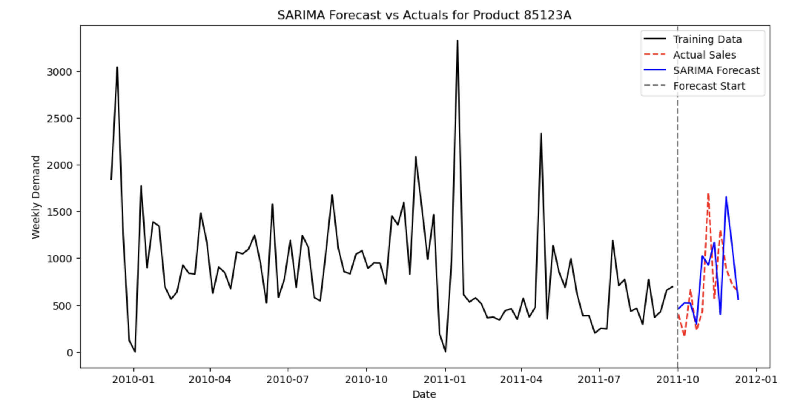

# retail-demand-forecasting
Demand forecasting using Prophet and SARIMA on online retail dataset

## Retail Demand Forecasting and Safety Stock Estimation
This project explores demand forecasting for a high-volume retail SKU using time-series models. The focus is on understanding how different forecasting methods perform on seasonal retail data and how forecast uncertainty can be used to estimate required safety stock for inventory planning. 

## Business Problem
Accurate demand forecasting is important in retail, especially for seasonal products. Poor forecasts can lead to stockouts or overstocking.

In this project, I aim to forecast demand for a popular retail SKU and use th forecast error to estimate safety stock at a given service level.

## Dataset
Source: UCI Machine Learning Repository - Online Retail II
Time Period: 2009-2011

## Data Cleaning
- Cancellations and returns were removed
- Invalid (negative) quantities were excluded
- Focused on a single high-volume SKU - '85123A'

## Modelling Approach
Weekly demand was aggregated and split chronologically into training and testing datasets. Two forecasting approaches were implemented and compared:

### 1. Prophet
Commonly used for business time series forecasting

### 2. SARIMA 
Classical statistical time series model

## Model Performance 

| Model    |  MAPE  |  RMSE  |
|----------|--------|--------|
| Prophet  | 0.79   |  414   |
| SARIMA   | 0.73   |  524   |

- Prophet produced smoother forecasts with lower RMSE
- SARIMA captured seasonality but showed higher volatility 

## Forecast Visualisations

### Prophet Forecast vs Actuals

### SARIMA Forecast vs Actuals

## Inventory Decision
To connect the forecasting results to inventory planning, forecast error (RMSE) was used to calculate safety stock assuming a 95% service level and a fixed lead time.

## Key Takeaways
- Different forecasting methods can lead to different inventory decisions
- Incorporating seasonality and holidays improves forecasts
- Translating forecast error into safety stock is important for supply chain planning
